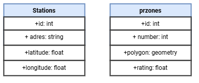

## **WEB-ПРИЛОЖЕНИЕ ДЛЯ ВИЗУАЛИЗАЦИИ ЭЛЕКТРОЗАРЯДНЫХ СТАНЦИЙ И ОПТИМАЛЬНЫХ МЕСТ РАЗМЕЩЕНИЯ.**


Приложение имеет клиент-серверную архитектуру.
### ***Сервер***
Для храенения данных используется база данных PostgreSQL.<br>
<br>
*Где в Stations:*<br>
| Название | Описание |
| -------- | -------- |
| adres    | Адрес электрозаправочной станции |
| latitude | широта |
| longitude | долгота |

*в prsones:*<br>
| Название | Описание |
| -------- | -------- |
| number   | Адрес электрозаправочной станции |
| polygon | хранит в себе координаты для отображения полигона с приоритетными местами застройки |
| rating | приоритетность застройки |


### ***Клиент***
1. *Основной код для визуализации Яндекс карты реализован в `App.js` для этого необходим Api ключ для Яндекс карты:*

```javascript
    const initializeMap = () => {
      if (!window.ymaps) {
        const script = document.createElement('script');
        script.src = `https://api-maps.yandex.ru/2.1/?apikey=${apiKey}&lang=ru_RU`;
        script.onload = () => {
          if (mapInitiated) return;

          const mapContainer = document.getElementById('map');
          if (mapContainer) {
            mapContainer.innerHTML = '';

            window.ymaps.ready(() => {
              mapRef.current = new window.ymaps.Map("map", {
                center: [55.76, 37.64],
                zoom: 10,
                controls: []
              });

              setMapInitiated(true);
            });
          }
        };
    };
```
2. *Функция `handleZoneButtonClick1` отсылает нас на файл с названием `zoneHandler.js`, в котором релезованы следующие методы:*
   1. *Кнопка при нажатии на которую будут отображаться полигоны:*
   
```javascript
const handleZoneButtonClick = (mapRef, zoneRectangles, setZoneRectangles, objectsAdded, setObjectsAdded) => {
    if (!objectsAdded) {
      fetchZoneData(mapRef, setZoneRectangles);
      setObjectsAdded(true);
    } else {
      clearZones(mapRef, zoneRectangles, setZoneRectangles);
      setObjectsAdded(false);
    }
  };
  ```
  2. *Метод очищения карты при повторном нажатии кнопки:*
   
```javascript
const clearZones = (mapRef, zoneRectangles, setZoneRectangles) => {
    if (mapRef.current) {
      zoneRectangles.forEach((rectangle) => {
        mapRef.current.geoObjects.remove(rectangle);
      });
      setZoneRectangles([]);
    }
  };
```
   3. *Метод получения данных с сервера:*
   
```javascript
const fetchZoneData = (mapRef, setZoneRectangles) => {
    fetch('http://localhost:5000/api/Zone')
      .then(response => response.json())
      .then(data => {
        const polygonLayers = data.map(item => {
          const { polygon, rating } = item;
          if (polygon && polygon.coordinates) {
            return processPolygon(polygon.coordinates, rating);
          } else {
            console.error('Некорректные данные полигона:', item);
            return null;
          }
        }).filter(layer => layer !== null);
  
        if (mapRef.current) {
          const newZoneRectangles = [];
          polygonLayers.forEach(layer => {
            mapRef.current.geoObjects.add(layer);
            newZoneRectangles.push(layer);
          });
          setZoneRectangles(newZoneRectangles);
        }
      })
      .catch(error => {
        console.error('Ошибка при получении данных полигонов:', error);
      });
  };
```
   4. *Метод отображения полигонов на Яндекс Карте:*
   
```javascript
  const processPolygon = (coordinates, rating) => {
    const color = getRatingColor(rating);
    try {
      return new window.ymaps.GeoObject({
        geometry: {
          type: 'Polygon',
          coordinates: coordinates,
        },
        properties: {
          hintContent: `Рейтинг: ${rating}`,
          balloonContent: `Рейтинг: ${rating}`,
        },
      }, {
        fillColor: color,
        strokeColor: '#0000ff',
        opacity: 0.5,
      });
    } catch (error) {
      console.error('Ошибка при создании полигона:', error);
      return null;
    }
  };
```
   5. *Метод для определения цвета полигона исходя из значения приоритетности:*
   
```javascript
  const getRatingColor = (rating) => {
    if (rating === 0) {
      return 'rgba(255, 0, 0, 0.5)'; // Красный цвет для рейтинга равному 0
    } else if (rating > 0 && rating < 0.5) {
      return 'rgba(255, 255, 0, 0.5)'; // Желтый цвет для рейтинга от 0 до 0,5
    } else {
      return 'rgba(0, 255, 0, 0.5)'; // Зеленый цвет для рейтинга больше 0,5
    }
  };
```
2. *Функция `handleStationeButtonClick1` отсылает нас на файл с названием `StationHandler.js`, в котором релезованы следующие методы:*
    1. *Кнопка при нажатии на которую будут отображаться электрозарядные станции:*
   
```javascript
const handleStationButtonClick = (mapRef, stationPlacemarks) => {
    if (stationPlacemarks.current.length === 0) {
      fetchStationData(mapRef, stationPlacemarks);
    } else {
      clearStations(mapRef, stationPlacemarks);
    }
  };
  ```
  2. *Метод очищения карты при повторном нажатии кнопки:*
   
```javascript
const clearStations = (mapRef, objectsAdded1) => {
    objectsAdded1.current.forEach((placemark) => {
      mapRef.current.geoObjects.remove(placemark);
    });
    objectsAdded1.current = [];
  };
```
   3. *Метод получения данных с сервера и отображения меток электрозарядных станций на Яндекс карте:*
   
```javascript
const fetchStationData = (mapRef, objectsAdded1) => {
    fetch('http://localhost:5000/api/Station')
      .then(response => response.json())
      .then(data => {
        data.forEach(coord => {
          const placemark = new window.ymaps.Placemark(
            [coord.latitude, coord.longitude],
            { hintContent: coord.address }
          );
  
          objectsAdded1.current.push(placemark);
          mapRef.current.geoObjects.add(placemark);
        });
      })
      .catch(error => {
        console.error('Error fetching station data:', error);
      });
  };
```
3. *Теги `<input/>` необходимы для добавления в базу данных PostgreSQL с помощью файла формата .csv данных для электрозарядных станций и приорететных мест застройки:*
   1. *Функция `handleFileInputChange` и `handleFileInputChange2` отсылает нас к файлу `addFiles.js` в котором реалезован код отправки загруженного файла по указенному URL на сервер:*
        1. *Отправление файла с электрозаправочными станциями:*
   
```javascript
const handleFileInputChange = async (event) => {
    const file = event.target.files[0];
    const formData = new FormData();
    formData.append('file', file);
  
    try {
        const response = await axios.post   ('http://localhost:5000/api/upload', formData, {
            headers: { 'Content-Type': 'multipart/form-data' }
            });
    } catch (error) {
            console.error('Error uploading file:', error);
    }
};
```
   1. *Отправление файла с приорететными местами застройки:*
   
```javascript
const handleFileInputChange2 = async (event) => {
    const file = event.target.files[0];
    const formData = new FormData();
    formData.append('file', file);
  
    try {
      const response = await axios.post('http://localhost:5000/api/upload2', formData, {
        headers: { 'Content-Type': 'multipart/form-data' }
      });
      console.log(response.data);
    } catch (error) {
      console.error('Error uploading file:', error);
    }
  };
```